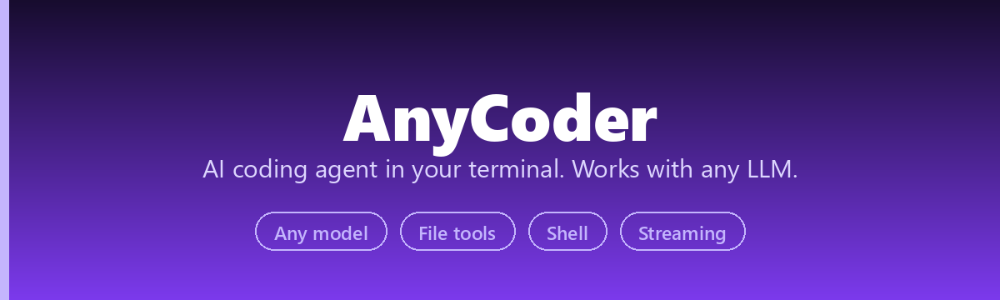
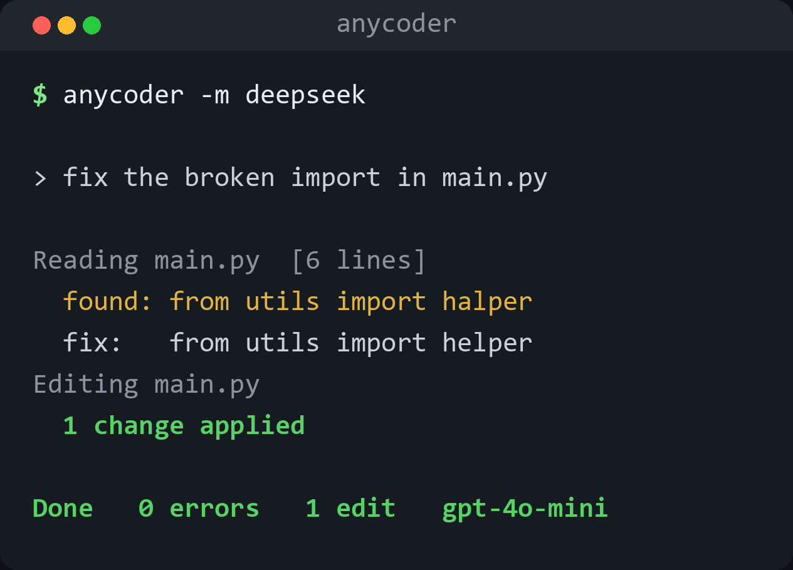

<div align="center">



[](https://pypi.org/project/anycoder/)
[](https://python.org)
[](LICENSE)
[](https://github.com/he-yufeng/AnyCoder/actions)

[**Quick Start**](#quick-start) · [**Models**](#supported-models) · [**Tools**](#built-in-tools) · [中文](README_CN.md)

</div>

<p align="center"></p>

DeepSeek, Qwen, GPT-5, Claude, Gemini, Kimi, GLM, Ollama local models - pick your favorite and start coding.

---

```
$ anycoder -m deepseek

> read main.py and fix the broken import

  Reading main.py
  ╭──────────────────────────────────────╮
  │ [6 lines total]                      │
  │      1  from utils import halper     │
  │      ...                             │
  ╰──────────────────────────────────────╯

  Editing main.py
  ╭──────────────────────────────────────╮
  │ Edited main.py                       │
  │ --- a/main.py                        │
  │ +++ b/main.py                        │
  │ @@ -1 +1 @@                          │
  │ -from utils import halper             │
  │ +from utils import helper             │
  ╰──────────────────────────────────────╯

Fixed: halper → helper.

  deepseek-chat | tokens: 1,247 | cost: $0.0004
```

## Why AnyCoder?

Claude Code is the best AI coding tool out there, but it only works with Anthropic's API. Want to use DeepSeek (cheap and fast)? Qwen (great for Chinese devs)? A local model via Ollama? You're out of luck.

AnyCoder gives you the same experience - file editing, shell commands, codebase search, context management - with **whatever LLM you want**.

**What it does:**

- **100+ LLM providers** via [litellm](https://github.com/BerriAI/litellm) - one CLI, any model
- **Agent loop with tool use** - reads files, writes code, runs commands, searches codebases
- **Streaming output** - see responses as they generate, token by token
- **Context compression** - auto-compresses when conversations get long (snip tool outputs first, then summarize)
- **Search & replace editing** - precise modifications with uniqueness checking and diff output
- **Dangerous command blocking** - catches `rm -rf /`, fork bombs, `curl | bash`, etc.
- **Parallel tool execution** - runs multiple independent tool calls concurrently
- **Session persistence** - save and resume conversations with `/save` and `--resume`
- **`.env` support** - drop a `.env` in your project root and go
- **~1,450 lines of Python** - small enough to read, hack, and extend

## Installation

```bash
pip install anycoder
```

## Quick Start

```bash
# Set your API key (pick one)
export DEEPSEEK_API_KEY=sk-...    # DeepSeek (default)
export OPENAI_API_KEY=sk-...      # OpenAI
export ANTHROPIC_API_KEY=sk-...   # Claude
export GEMINI_API_KEY=...         # Gemini

# Use DeepSeek (default, cheap and fast)
anycoder

# Use Kimi K2.5
anycoder -m kimi

# Use Claude Sonnet 4.6
anycoder -m claude

# Use GPT-5.4
anycoder -m gpt5

# Use Qwen
anycoder -m qwen

# Use local Ollama, data never leaves your machine
anycoder -m ollama/qwen3:32b

# One-shot mode
anycoder "add error handling to the login function in auth.py"
anycoder -p "find all TODO comments and list them"

# Resume a saved session
anycoder --resume session_1712345678
```

Or use a `.env` file in your project root:

```bash
# .env
DEEPSEEK_API_KEY=sk-...
ANYCODER_MODEL=deepseek
```

## Supported Models

Use short aliases or full [litellm model names](https://docs.litellm.ai/docs/providers):

| Alias | Model | Provider |
|-------|-------|----------|
| `deepseek` | DeepSeek Chat (V3) | DeepSeek |
| `deepseek-r1` | DeepSeek Reasoner (R1) | DeepSeek |
| `gpt5` / `gpt-5` | GPT-5.4 | OpenAI |
| `gpt4o` | GPT-4o | OpenAI |
| `o4-mini` | o4-mini | OpenAI |
| `claude` | Claude Sonnet 4.6 | Anthropic |
| `claude-opus` | Claude Opus 4.6 | Anthropic |
| `claude-haiku` | Claude Haiku 4.5 | Anthropic |
| `gemini` | Gemini 2.5 Flash | Google |
| `gemini-pro` | Gemini 2.5 Pro | Google |
| `qwen` | Qwen Plus | Alibaba |
| `qwen-max` | Qwen Max | Alibaba |
| `kimi` | Kimi K2.5 | Moonshot AI |
| `glm` | GLM-4 Plus | Zhipu AI |

### Local Models (Ollama)

```bash
ollama serve
anycoder -m ollama/llama3.1
anycoder -m ollama/codestral
anycoder -m ollama/qwen3:32b
```

### Custom OpenAI-Compatible APIs

```bash
export ANYCODER_API_BASE=https://your-api.com/v1
export ANYCODER_API_KEY=your-key
anycoder -m your-model-name
```

## Tools

AnyCoder has 7 built-in tools that the LLM calls automatically:

| Tool | What it does |
|------|-------------|
| `bash` | Run shell commands with dangerous command blocking and cd tracking |
| `read_file` | Read files with line numbers, offset/limit for large files |
| `write_file` | Create new files or overwrite existing ones |
| `edit_file` | Search-and-replace edits with uniqueness checking and diff output |
| `glob` | Find files by pattern (`**/*.py`, `src/**/*.ts`) |
| `grep` | Search file contents with regex |
| `run_tests` | Detect and run the project's tests (pytest, npm/pnpm/yarn) and report failures |

You describe what you want in natural language. The agent decides which tools to use.

## Commands

| Command | Description |
|---------|-------------|
| `/model` | Show current model |
| `/model <name>` | Switch model mid-conversation |
| `/models` | List all model aliases |
| `/tokens` | Token usage and estimated cost |
| `/diff` | Files modified this session |
| `/undo` | Revert the most recent file change |
| `/compact` | Manually compress context |
| `/save [name]` | Save session to disk (names are sanitized before they become filenames) |
| `/sessions` | List saved sessions |
| `/clear` | Clear conversation history |
| `/help` | Show all commands |
| `/quit` | Exit |

**Input:** Enter to send, Esc+Enter for newline (multiline input), Ctrl+C to cancel, Ctrl+D to exit.

## Architecture

~1,600 lines total. Here's how it's organized:

```
anycoder/
├── cli.py            REPL + slash commands          258 lines
├── llm.py            litellm streaming wrapper      184 lines
├── agent.py          Agent loop + parallel tools    179 lines
├── context.py        Two-phase compression           92 lines
├── config.py         Env + .env + model aliases      86 lines
├── session.py        Save/resume sessions            83 lines
├── prompts/system.py System prompt generation        51 lines
└── tools/
    ├── bash.py       Shell + safety + cd tracking   130 lines
    ├── edit_file.py  Search-replace + diff output    98 lines
    ├── grep_tool.py  Regex search + skip binary     111 lines
    ├── run_tests.py  Detect and run project tests   113 lines
    ├── read_file.py  File reading + binary detect    70 lines
    ├── glob_tool.py  File pattern search             48 lines
    └── write_file.py File writing + tracking         39 lines
```

**How the agent loop works:**

1. User message gets added to conversation history
2. History + tool schemas are sent to the LLM (streaming)
3. If the LLM returns text, it's printed to the terminal
4. If the LLM returns tool calls, each tool is executed and results are appended
5. Go to step 2 until the LLM responds with text only (no more tool calls)
6. Context manager auto-compresses when approaching the token limit

**Two-phase compression** (inspired by Claude Code):
- Phase 1: Snip long tool outputs (keeps conversation structure intact)
- Phase 2: Summarize old conversation turns if still over threshold

## Configuration

Environment variables or `.env` file:

| Variable | Description | Default |
|----------|-------------|---------|
| `ANYCODER_MODEL` | Default model | `deepseek/deepseek-chat` |
| `ANYCODER_API_BASE` | Custom API base URL | - |
| `ANYCODER_API_KEY` | API key | - |
| `DEEPSEEK_API_KEY` | DeepSeek API key | - |
| `OPENAI_API_KEY` | OpenAI API key | - |
| `ANTHROPIC_API_KEY` | Anthropic API key | - |
| `GEMINI_API_KEY` | Google AI API key | - |

## Use as a Library

```python
from anycoder import Agent, Config

config = Config(model="deepseek/deepseek-chat", api_key="sk-...")
agent = Agent(config)
agent.run("find all TODO comments in this project")
```

## Comparison

| Feature | Claude Code | Cline | Aider | **AnyCoder** |
|---------|-------------|-------|-------|-------------|
| LLM support | Claude only | Multi | Multi | **100+ via litellm** |
| Language | TypeScript (closed) | TypeScript | Python | **Python (MIT)** |
| Install | `npm` | VS Code ext | `pip` | **`pip`** |
| File editing | Search & replace | Diff | Diff | **Search & replace** |
| Context compression | Yes | No | Yes | **Yes (two-phase)** |
| Streaming | Yes | Yes | Yes | **Yes** |
| Session persistence | Yes | No | Yes | **Yes** |
| Code size | 512K lines | 100K+ | 50K+ | **~1,600 lines** |
| Best for | Using it | Using it | Using it | **Using it AND reading the source** |

## Roadmap

The point of AnyCoder is that the whole agent fits in your head, so the roadmap is about reach, not heft. Anything added has to stay readable in ~1,500 lines.

- **MCP client support** — let AnyCoder use Model Context Protocol servers as tools, so the same agent can drive whatever an MCP server exposes.
- **Plan-then-act mode** — show the plan and the files it intends to touch, get one approval, then execute, for people who want a checkpoint before edits land.
- **Pluggable edit strategies** — search-and-replace is the default; a diff/patch strategy would handle large files and multi-hunk edits more cleanly.

If a feature can't be added without making the source hard to read end to end, it doesn't belong here. That's the whole pitch.

## Development

```bash
git clone https://github.com/he-yufeng/AnyCoder.git
cd AnyCoder
pip install -e ".[dev]"
pytest tests/ -v
```

## Related Projects

AnyCoder is one of my coding-agent projects. A few others worth a look:

- **[CoreCoder](https://github.com/he-yufeng/CoreCoder)** — want to understand how a coding agent really works? Read the whole ~1k-line engine end to end, not a black box.
- **[CodeABC](https://github.com/he-yufeng/CodeABC)** — understand any codebase even if you don't code, built for non-programmers.
- **[CodeJoust](https://github.com/he-yufeng/CodeJoust)** — which coding agent fixes your bug best? Race Claude Code, aider, Codex and Gemini, and score the winner.

## License

MIT. Use it, fork it, build something better.

---

Built by **[Yufeng He](https://github.com/he-yufeng)** · Agentic AI Researcher @ Moonshot AI (Kimi)
